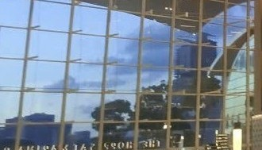

# WannaGame Recruit 2026 - grid

### Category: Misc

### Description:

>Author: s3asick5

>The suspect is hiding somewhere, taunting us with a tiny and blurry picture taken on his ancient phone. He told us that he was planning to replace it with a new one from a strange but famous electronics store nearby. After deciding where to buy the new phone, he dumped his old one there and disappeared again.

>We need to find the location of that store and speak with the employees who may have seen him. If we can reach them before the suspect moves on again, they might be able to tell us where he went.

>Flag format: W1{3 words from https://what3words.com/ }

>Example: W1{metro.share.settle}

## Solution
Chúng ta có thể nhìn thấy hình ảnh phản chiếu của một dòng chữ, khi lật ngược bức ảnh lại thì ta thấy được những chữ sau: "THE HOPP SA MARINA"

Ta google search thì có thể tìm thấy hoàn chỉnh tên địa điểm tại `The Shoppes at Marina Bay Sands`

Trên đề bài có gợi ý về `electronics store` nên ta có thể search những cửa hàng gần đó trên google maps và tìm thấy cửa hàng gần nhất là `Apple Marina Bay Sands`

Cuối cùng, chúng ta nhập cửa hàng điện tử trên vào `https://what3words.com/` thì ta sẽ có flag
### Flag
W1{fishery.leans.arrive}