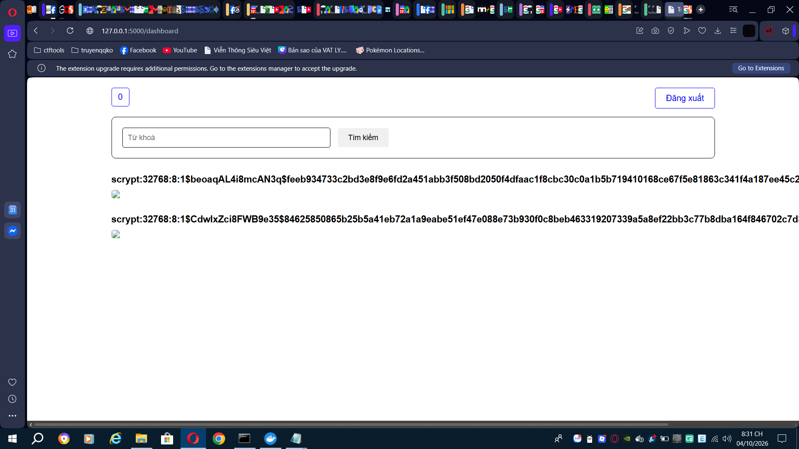
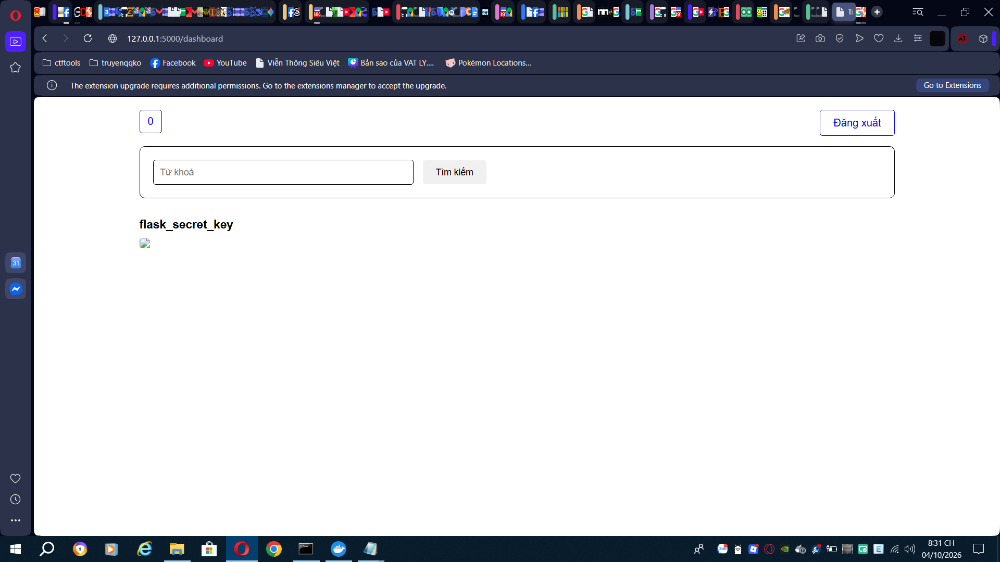
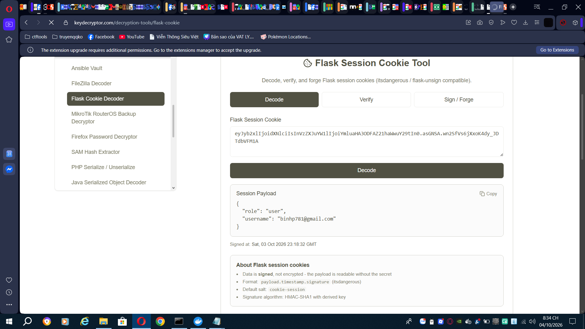
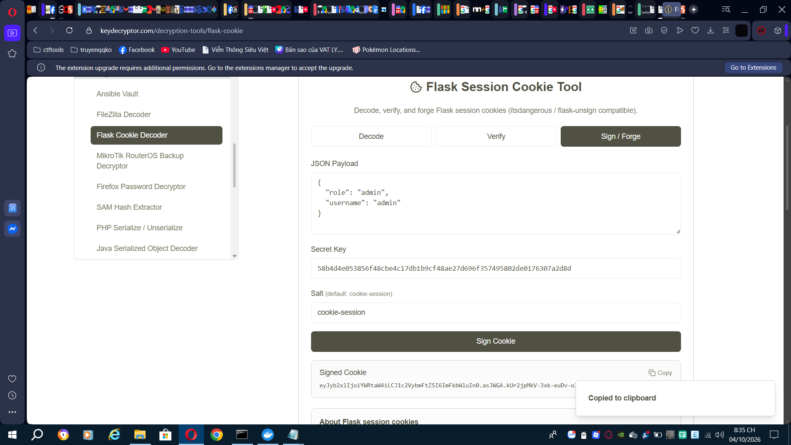
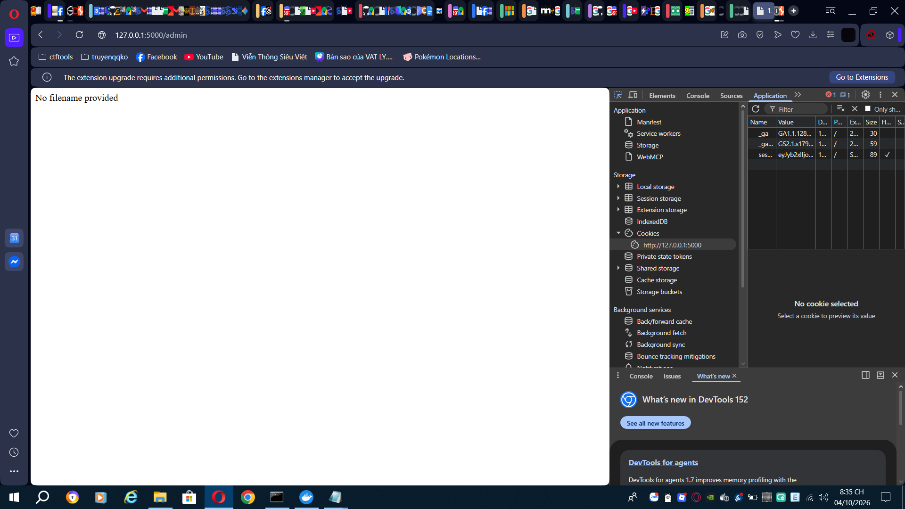
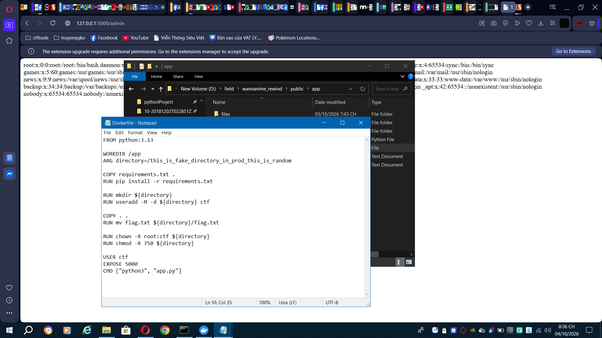

# aochinh26 - Wannanime

### Category: Web

### Description:
>Author: Winky

>Tìm kiếm anime mà bạn yêu thích

## Solution

First we check what was changed in `Wannanime_rewind` using `diff -r`

```bash
root@DESKTOP-5UQIQJM:/mnt/d/field# diff -r wannanime wannanime_rewind
diff -r wannanime/public/app/app.py wannanime_rewind/public/app/app.py
5a6,7
> import time
> from werkzeug.security import generate_password_hash, check_password_hash
8d9
< app.config['SECRET_KEY'] = secrets.token_hex(20)
19a21,47
> def initialize_security():
>     for _ in range(30):
>         conn = None
>         try:
>             conn = get_conn()
>             with conn.cursor() as cursor:
>                 cursor.execute(
>                     'INSERT IGNORE INTO settings (name, value) VALUES (%s, %s)',
>                     ('flask_secret_key', secrets.token_hex(32))
>                 )
>                 cursor.execute(
>                     'INSERT IGNORE INTO users (username, password, role) VALUES (%s, %s, %s)',
>                     ('admin', generate_password_hash(secrets.token_urlsafe(32)), 'admin')
>                 )
>                 conn.commit()
>                 cursor.execute("SELECT value FROM settings WHERE name=%s", ('flask_secret_key',))
>                 app.config['SECRET_KEY'] = cursor.fetchone()['value']
>             return
>         except pymysql.MySQLError:
>             time.sleep(1)
>         finally:
>             if conn is not None:
>                 conn.close()
>     raise RuntimeError('Could not initialize security settings from MySQL')
>
> initialize_security()
>

------------------------------>Made sure admin's password were properly hashed this time, also with a secured secrets.token_urlsafe(32))
------------------------------>The flask_secret_key is now secrets.token_hex(32) and got put in the settings table, this will be useful later

42c70,71
<             cursor.execute('INSERT INTO users (username, password) VALUES (%s, %s)',(username, password))
---
>             cursor.execute('INSERT INTO users (username, password) VALUES (%s, %s)',
>                            (username, generate_password_hash(password)))
69c98
<             if user['password'] != password:
---
>             if not check_password_hash(user['password'], password):

------------------------------>new users' password were hashed now

134c163
<     app.run(host='0.0.0.0', port=5000, threaded=True)
\ No newline at end of file
---
>     app.run(host='0.0.0.0', port=5000, threaded=True)
diff -r wannanime/public/db/init.sql wannanime_rewind/public/db/init.sql
2a3
> DROP TABLE IF EXISTS settings;
9c10
<     password VARCHAR(100) NOT NULL,
---
>     password VARCHAR(255) NOT NULL,
12a14,18
> CREATE TABLE IF NOT EXISTS settings (
>     name VARCHAR(100) PRIMARY KEY,
>     value VARCHAR(255) NOT NULL
> ) ENGINE=InnoDB DEFAULT CHARSET=utf8mb4 COLLATE=utf8mb4_bin;
>
21d26
< INSERT INTO users (username, password, role) VALUES ('admin', 'this_is_fake_admin_password_will_be_change_in_prod', 'admin');
```

So we didn't see any changes about the SQLi search function. So using the last challenge's payload, we get this screen


With an SQLi vulnerability, I tried to `UPDATE` the admin's password but it wasn't successful due to `MYSQL`'s protection against stacked queries

Do you remember the `flask_secret_key` I mentioned above? Yeah we can access that through the SQLi, and use it to sign a new flask session that make us `admin`


I used a website called `Flask Session Cookie Tool` to decode the payload and sign it with `flask_secret_key`






We successfully access the admin's screen. In the previous problem, we check the Dockerfile to see the path to the flag, we'd do the same thing here too


The final path to the flag: 
```text
127.0.0.1:5000/admin?filename=/this_is_fake_directory_in_prod_this_is_random/flag.txt
```


### Flag
flag{fake_flag}


